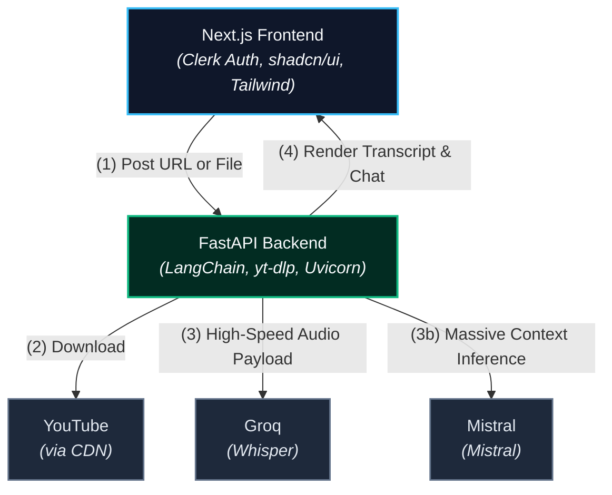

# 📝 Scribe

Scribe is an entirely free, open-source **Retrieval-Augmented Generation (RAG)** platform designed to turn long audio/video content into highly interactive chat sessions. By providing a public YouTube link or uploading local Google Meet audio files, Scribe processes, transcribes, and structures content, allowing users to deeply question long-form audio in real time.

---

## 🏗️ Core Architecture Flow

Scribe utilizes a split-stack architecture, isolating client-side user experience from resource-heavy AI processing pipelines.




1. **Ingestion & Extraction:** The frontend captures a video URL or an uploaded audio recording and ships it to the Python gateway. YouTube payloads are streamed dynamically via `yt-dlp` and isolated down to pure `.mp3` tracks.
2. **Transcription Pipeline:** The backend maps audio bytes directly to the **Groq Whisper API**, transcribing large volumes of spoken content in seconds for zero computational cost.
3. **Execution Context (LangChain LCEL):** The resulting transcription text block is structured through LangChain Expression Language and injected straight into **Google Gemini’s massive context window**, bypassing the need for complex vector databases on standard meetings.

---

## 🛠️ The Tech Stack

### Frontend Ecosystem (`/app`)
* **Framework:** Next.js 15 (App Router, TypeScript)
* **Authentication:** Clerk SDK (Secure Session Middleware)
* **Styling Framework:** Tailwind CSS
* **Design Engine:** shadcn/ui (Radix Primitives)

### AI & Systems Backend (`/ai`)
* **Framework Engine:** FastAPI (Python 3.11+)
* **Streaming Client:** `yt-dlp` (Audio extraction interface)
* **Orchestration Layer:** LangChain & LCEL (Prompt chaining)
* **Inference Engines:** Groq SDK (Whisper-Large-v3) & Mistral
* **Binary Processing:** FFmpeg Core Architecture

---

## 📂 Project Structure Blueprint

```text
scribe/
├── ai/                      # FastAPI Python AI Backend
│   ├── main.py              # Core API endpoints & LangChain execution pipelines
│   ├── requirements.txt     # Python environment requirements
│   └── .env.example         # Template for backend server secrets
└── app/                     # Next.js Frontend UI
    ├── components/          # Scaffolding for shadcn components
    ├── db/                  # Drizzle structural database mapping
    │   ├── index.ts         # Database instance initialization
    │   └── schema.ts        # Table definition schemas
    ├── app/                 # Next.js page layers
    │   ├── layout.tsx       # Root wrap containing Clerk providers
    │   ├── page.tsx         # Active dashboard UI layout
    │   └── middleware.ts    # Clerk routing auth engine
    ├── drizzle.config.ts    # Drizzle local configuration controllers
    ├── package.json
    └── .env.example         # Template for client-side keys